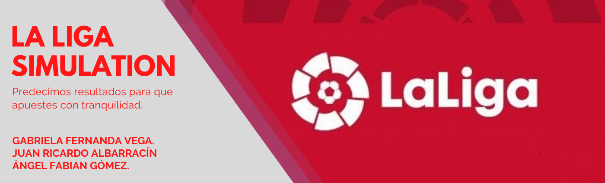

# La-Liga-Simulation

Bienvenido a nuestro proyecto.

Este proyecto fue propesto para la asignatura Simulación Digital en mi carrera de Ingeniería de Sistemas. Mediante el uso de la simulación de Montecarlo recreamos el comportamiento de una temporada de la liga española haciendo uso de un dataset de los datos historicos de partidos de la liga, con ellos econtramos distribuciones de probabilidad y mediante números aleatorios generamos simulaciones y predicciones para que alguien pueda realizar apuestas o usar la simulación en un videojuego.

Video explicativo: https://www.youtube.com/watch?v=4G9GOMU7yFQ&t=10s

Para la ejecución del notebook recomendamos el uso de la herramienta Google Colaboratory.
FMEL_Dataset.cvs es el dataset que usamos para nuestro proyecto, está anexo junto con el Notebook.
